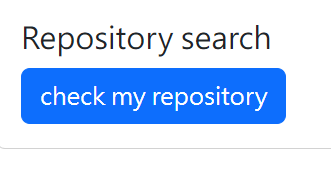

### OAuth2.0 flow implement practice

-----
Implement OAuth2.0 code flow with **GitHub api** to access user's public info and **private repository**. Demonstrate the repository title, description and the link in the frond end with **bootstrap**. Using **python/django** for backend.

-----

#### screenshots:
* The home page of the web

* Link to GitHub authentication 

* Show all the repositories the user has

